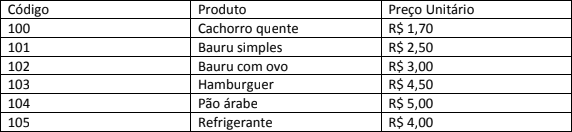

# 2a Avaliação
### Disciplina: Web
#### Professor: Wagner

Utilizando o JS desenvolva o que se pede:

1. Leia 20 valores reais e calcule seu somatório utilizando a instrução while.
2. Leia 20 valores reais e calcule seu somatório utilizando a instrução do...while.
3. O cardápio de uma casa de lanches é dado pela tabela abaixo:

Escreva um algoritmo que leia o código do item adquirido pelo consumidor e a quantidade,
calculando e mostrando o valor a pagar. Não será necessário exibir o produto e o valor,
somente o valor final.