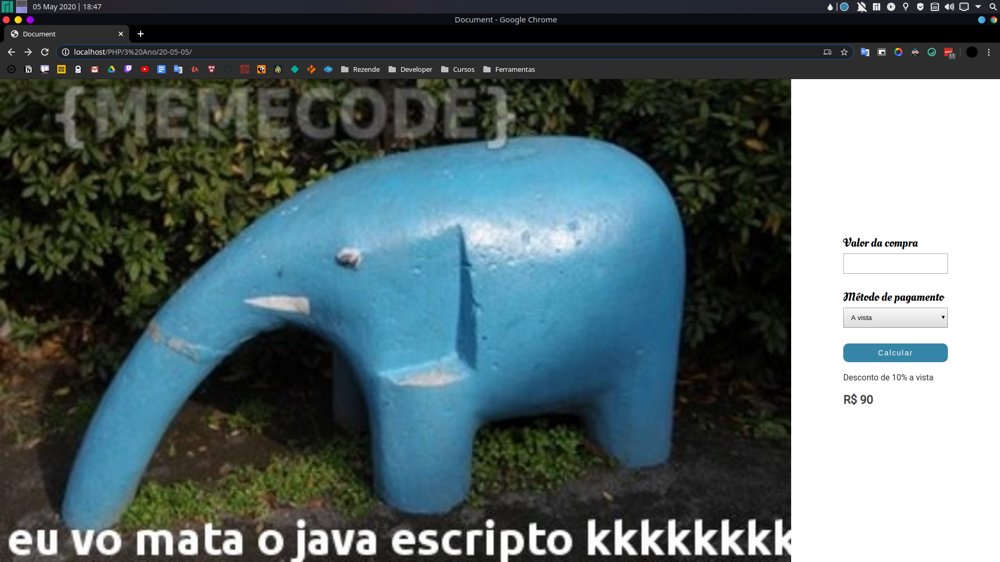

## Trabalho em php - 2 pontos




### Entrega: 07/05/20
Criar um formulário de pagamento onde teremos:

- Valor da compra
- Forma de pagamento

```html
<input type="text" class="puchaseAmount">
<select name="paymentMethod" id="">
  ...
</select>
```

Com o select onde as as opção são pagamento

- A vista
- Débito
- Crédito

```html
<option value="vista">A vista</option>
<option value="debito">Débito</option>
<option value="credito">Crédito </option>
```

Ao enviar teremos o resultado que será o seguinte.

- A vista = 10% de desconto
- Débito = 5% de desconto
- Crédito = sem desconto

```php
$discount = array(
  "vista" => 0.1,
  "debito" => 0.05,
  "credito" => 0
);
```

ao final mostre o valor menos o seu determinado desconto..
Usar

- [x] Switch
- [x] isset
- [x] Unico arquivo php


