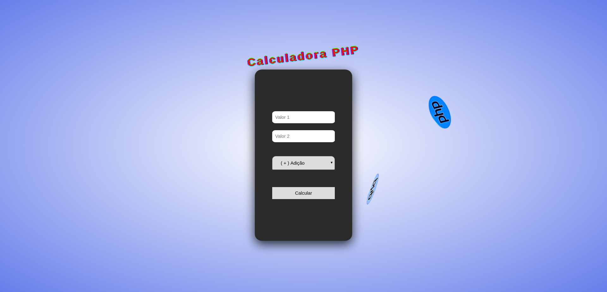

## Objetivo:

Desenvolva um site em php de calculadora da seguinte forma.

- Valor 1 (text)
- Valor 2 (text)
- Operação (select)
- Calcular (botão enviar)
- Resultado (text)

Os campos valor1, valor2 e resultado (text)

```html
<input type="text" name="value1" placeholder="Valor 1" />
<input type="text" name="value2" placeholder="Valor 2" />
<h2 class="resul"></h2>
```

O campo operação do tipo (select) com as seguintes opções (somar, subtrair , multiplicar, dividir).

```html
<select name="option" id="">
  <option value="addition">( + ) Adição</option>
  <option value="subtraction">( - ) Subtração</option>
  <option value="multiplication">( * ) Multiplicação</option>
  <option value="division">( / ) Divisão</option>
  <option value="module">( % ) Módulo</option>
  <option value="exponentiation">( ** ) Exponencial</option>
</select>
```

## Funcionamento:

O usuário digita o valores, escolhe a operação e clica em calcular, o resultado deve aparecer no campo Resultado.

## Data da entrega:

18/05/2020
